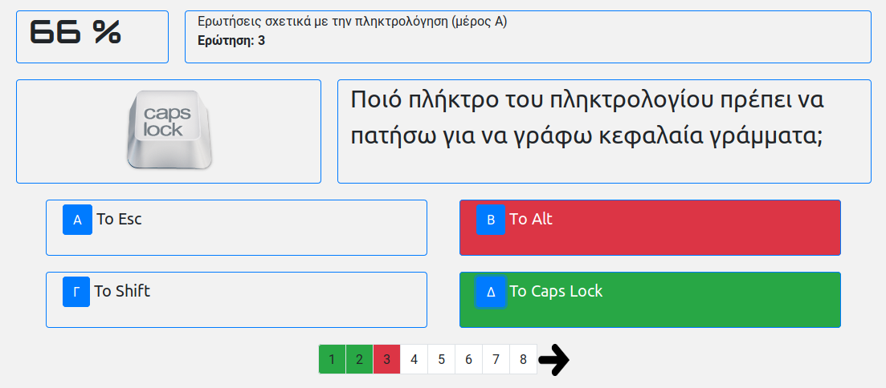

# quiz_engine

# Περί
Είναι μια δικτυακή εφαρμογή για (μαθητικά) quiz. Παλαιότερα χρησιμοποιούσα το hot potatoes. Δυστυχώς όμως δεν μπορεί πλέον να κρύψει την ηλικία του και προσπάθησα να δημιουργήσω κάτι εναλλακτικό. 

Τεχνικά, η quiz_enigne είναι γραμμένη σε Javascript (JQuery)

Επίσης είναι επεκτάσιμο, υπό την έννοια ότι υποστηρίζει τη δημιουργία νέων κουίζ σε μορφή json, τα οποία μπορούν να φορτωθούν στην εφαρμογή. Με αυτό τον τρόπο μπορεί να δημιουργήσει ένα κουίζ ακόμη και κάποιος που δεν έχει γνώσεις προγραμματισμού. Η μορφή json την οποία πρέπει να έχει ένα κουίζ, μπορεί να την δει κάποιος κοιτώντας το αρχείο ενός έτοιμου κουίζ. Για παράδειγμα [αυτό](https://github.com/ale3andro/quiz_engine/blob/master/quizes/c_011.json). Για να προσθέσει κανείς και φωτογραφίες στις ερωτήσεις του κουίζ, αρκεί να δημιουργήσει έναν φάκελο με τό ίδιο όνομα με το αρχείο json του κουίζ, μέσα στον φάκελο [quizes](https://github.com/ale3andro/quiz_engine/tree/master/quizes).
Στην αρχική σελίδα της εφαρμογής, παρουσιάζεται μια λίστα των διαθέσιμων κουίζ που υπάρχουν στην εφαρμογή. Η λίστα αυτή προέρχεται από το αρχείο [quizes/quizes_list](https://github.com/ale3andro/quiz_engine/blob/master/quizes/quizes_list). Σε περίπτωση που γίνει προσθήκη περισσότερων κουίζ, υπάρχει το script [quizes_list_renew_bash_script](https://github.com/ale3andro/quiz_engine/blob/master/quizes/quizes_list_renew_bash_script)  (για Linux μόνο), το οποίο δημιουργεί ξανά τη λίστα των διαθέσιμων quizes.

# Εικόνα - screenshot
 

# Online δοκιμή
Για δοκιμή της εφαρμογής επισκεφθείτε [αυτή](http://www.sxoleio.pw/alx_code/quiz_engine/) τη σελίδα.

# Εγκατάσταση
Πριν από οτιδήποτε άλλο θα πρέπει να έχεις εγκατεστημένο το [bower](https://bower.io/)
Μετά κάνεις clone αυτό το repository και εγκαθιστάς τα dependencies

*bower install bootstrap4 jquery lightbox2 orbitron-googlefont ubuntu-googlefont*

